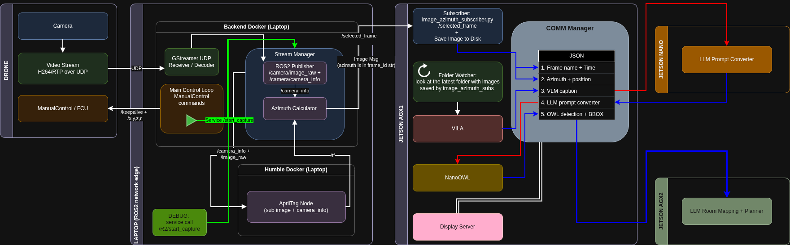

# Drone → ROS2 → VLM Pipeline

Minimal instructions to run the whole chain.

---
## Architecture diagram


## 0. Environment (all machines)

```bash
source ~/rqs_iai_ws/src/ros2_env.sh
```

## 1. Backend Docker – video → /R2/camera/image_raw

In the backend container (it):
```bash 
docker exec -it it bash
source ~/rqs_iai_ws/src/ros2_env.sh
cd ~/rqs_iai_ws/src/examples/src
python3 video_stream.py
```

Test with ros2 env:
```bash 
ros2 service call /R2/start_capture std_srvs/srv/Trigger
```
```bash 
ros2 topic info /R2/camera/image_raw
```

## 2. AGX1 – subscribe & save image + azimuth
On AGX1 (192.168.131.22):
```bash 
ssh user@192.168.131.22
source ~/rqs_iai_ws/src/ros2_env.sh
cd ~/rqs_iai_ws/src/examples/src
python3 image_azimuth_subscriber.py --out-dir /home/user/jetson-containers/data/R2
```

Test:
Check for new subfolder in /home/user/jetson-containers/data/R2 with images and JSON.

## 3. AGX1 – VLM Folder Watch
```bash 
ssh -X user@192.168.131.22
source ~/rqs_iai_ws/src/ros2_env.sh
cd ~/rqs_iai_ws/src/examples/src
python3 vlm_backfill_latest.py   --base-dir /home/user/jetson-containers/data/R2   --endpoint http://192.168.131.22:8080/describe    --watch-interval 5.0 --sleep-between 20 --timeout 60

```
## 4. Main – move drone and trigger captures

Back on backend (same it container as step 1):
* flight-mode: 1 ROLL, 2 FLIGHT
```bash 
docker exec -it it bash

cd rqs_iai_ws
source ~/rqs_iai_ws/src/ros2_env.sh
cd src/examples/src/keyboard_control
python3 main_run_path_and_capture.py --path txt/roll_custom_path.txt
```

## Test Checklist
* Backend video node:
  * ros2 topic echo /R2/camera/image_raw (should show images)

* Image/azimuth subscriber:
  * Check output folder for timestamped images/JSON files.

* VLM:
  * Confirm JSON files are updated with captions.

* Main movement:
  * Drone should move and trigger captures; images should save automatically