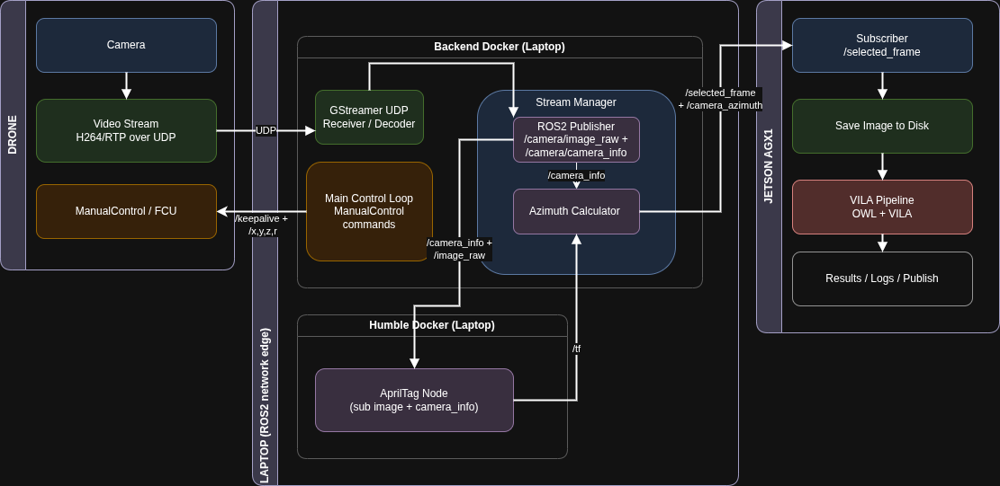

# Drone → ROS2 → VLM Pipeline

Minimal instructions to run the whole chain.

---
## Architecture diagram


## 0. Environment (all machines)

```bash
export ROS_DOMAIN_ID=2
export RMW_IMPLEMENTATION=rmw_cyclonedds_cpp
# Optional, if you use a custom CycloneDDS config:
# export CYCLONEDDS_URI=file:///etc/cyclonedds.xml     # backend
# export CYCLONEDDS_URI=file:///etc/cyclonedds/cyclonedds.xml  # jetson
```

## 1. Backend Docker – video → /R2/camera/image_raw

In the backend container (it):
```bash 
docker exec -it it bash
cd rqs_iai_ws
source /opt/ros/humble/setup.bash
source install/setup.bash
cd src/examples/src

```

Quick check (in same container):
```bash 
ros2 topic info /R2/camera/image_raw
```

## 2. AGX1 – subscribe & call VLM
On AGX1 (192.168.131.22):
```bash 
ssh user@192.168.131.22

export ROS_DOMAIN_ID=2
export RMW_IMPLEMENTATION=rmw_cyclonedds_cpp
# export CYCLONEDDS_URI=file:///etc/cyclonedds/cyclonedds.xml

source /opt/ros/humble/setup.bash
cd ~/rqs_iai_ws/src/examples/src
source ../../../install/setup.bash

python3 image_state_subscriber_call_vlm.py \
  --out-dir /home/user/jetson-containers/data/R2 \
  --vlm http://192.168.131.22:8080/describe

```
This node handles /R2/start_capture, /R2/frame_capture, /R2/stop_capture
and writes JPG + JSON with VLM text

## 3. Path runner + periodic capture

Back on backend (same it container as step 1):
* flight-mode: 1 ROLL, 2 FLIGHT
```bash 
docker exec -it it bash

cd rqs_iai_ws
source /opt/ros/humble/setup.bash
source install/setup.bash
cd src/examples/src


python3 main_run_path_and_capture.py \
  --rooster-id R2 \
  --flight-mode 1 \
  --path mamad_path_1.txt \
  --capture-period 1.0
```